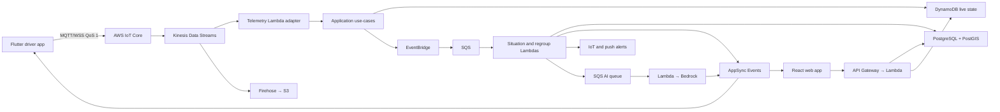

# Loopin

Loopin is an AI-assisted group-drive platform for keeping multi-vehicle trips coordinated with minimal driver distraction. It combines live route-aware vehicle tracking, graph-based convoy separation detection, safe regroup recommendations, role-specific notifications, voice interaction, and post-trip summaries.

The product is designed for family road trips, motorcycle groups, tourism convoys, corporate fleets, EV groups, and other journeys where several vehicles need to follow the same route safely.

> Loopin is a coordination and decision-support system. It is not collision-avoidance equipment, an autonomous-driving system, or a replacement for safe driving judgment.

## Product principles

1. **Safety before cohesion.** Loopin never encourages a driver to speed, brake suddenly, or follow another vehicle off-route.
2. **Route-aware, not crow-flies.** Separation uses progress and ETA along the planned route rather than straight-line distance.
3. **Deterministic safety logic.** Rules detect situations and select allowed actions. AI explains approved results and interprets voice commands; it does not invent safety decisions.
4. **Low distraction.** Driver messages are short, role-specific, voice-friendly, deduplicated, and prioritized.
5. **Honest location confidence.** Stale or inaccurate GPS is labeled and cannot independently trigger a high-confidence incident.
6. **Privacy by default.** Live location is trip-scoped, consent-based, access-controlled, and automatically expires.
7. **Serverless first, migration ready.** The initial AWS design uses managed services and Lambda while preserving contracts that allow the telemetry processor to move to ECS or Managed Apache Flink later.

## Core user journey

1. A leader creates a trip, route, departure time, and convoy policy.
2. Members join with a code or QR link and complete a GPS/readiness check.
3. The leader starts the trip; consenting drivers begin publishing location telemetry.
4. Loopin map-matches every vehicle to the route and orders vehicle nodes by route progress.
5. Adjacent node gaps form graph edges. Connected components represent contiguous convoy sections.
6. When a boundary edge remains beyond its speed-aware threshold, Loopin confirms a separation.
7. Front and rear sections receive different, safety-appropriate alerts.
8. Loopin ranks safe regroup candidates; the leader approves a noncritical action.
9. Members navigate to the regroup point and the graph returns to one component.
10. Loopin produces a post-trip event and safety summary.

## Technology stack

### Clients

| Surface | Stack | Purpose |
|---|---|---|
| Web | React 19, Vite, TypeScript, React Router, TanStack Query, Zustand, Tailwind CSS, shadcn/ui, MapLibre | Leader, coordinator, observer, trip planning, live map, incident management |
| Mobile | Flutter, Dart, Riverpod, go_router, Drift/SQLite, Amplify Flutter Auth, native location/TTS/haptic adapters | Driver tracking, offline buffer, voice, alerts, navigation and acknowledgements |

Participating drivers use the native mobile application because mobile browsers are not a reliable source of continuous background GPS. The web application can observe and coordinate trips.

### AWS backend

| Capability | Service |
|---|---|
| Identity | Amazon Cognito |
| HTTP APIs | API Gateway HTTP API + AWS Lambda |
| GPS ingestion | AWS IoT Core over MQTT/WSS QoS 1 |
| Telemetry stream | Kinesis Data Streams |
| Initial processing | Kinesis-triggered Lambda |
| Live state and idempotency | DynamoDB with TTL |
| Relational and geospatial data | PostgreSQL/PostGIS; RDS in development, Aurora PostgreSQL in production |
| Domain events | EventBridge |
| Background work and isolation | SQS with dead-letter queues |
| Client real-time updates | AWS AppSync Events |
| Raw telemetry | Firehose to S3 |
| AI language layer | Amazon Bedrock |
| Speech-to-text | Amazon Transcribe Streaming |
| Vietnamese speech output | Native mobile TTS behind a provider interface |
| Static web delivery | S3, CloudFront, Route 53 and AWS WAF |
| Observability | CloudWatch, X-Ray and OpenTelemetry |
| Infrastructure | AWS CDK in TypeScript |
| Delivery | GitHub Actions with AWS OIDC |

The primary deployment region is `ap-southeast-1` (Singapore).

## System overview



## Convoy graph in one minute

Every vehicle is a node projected onto the route. Nodes are sorted by route progress and adjacent nodes are connected by an edge while their gap remains within the configured cohesion policy.

```text
Direction →

Leader ─ Car 2 ─ Car 3 ───── gap ───── Car 4 ─ Car 5
└────── front component ─────┘          └ rear component ┘
```

The separation is measured between the boundary vehicles, Car 3 and Car 4, along the route. Vehicle order is derived continuously, so Car 5 can safely overtake Car 4 without breaking the model. Reordering must remain stable long enough to overcome GPS jitter.

The product uses two distinct concepts:

- **Minimum following distance:** a lower safety bound. Phone GPS cannot enforce bumper-level collision avoidance, so any close-gap indication is advisory and confidence-gated.
- **Maximum convoy-cohesion distance:** an upper bound used to stretch or break an edge and create separate components.

Default cohesion values and state transitions are specified in [Convoy Intelligence](docs/convoy-intelligence.md).

## Proposed repository layout

```text
loopin/
├── apps/
│   ├── web/                       # Implemented landing, setup, live replay and summary
│   ├── mobile/                    # Flutter/Dart driver client
│   └── simulator/                 # Runnable dataset-driven convoy simulation
├── services/
│   ├── application/               # Implemented use-cases, ports and memory adapters
│   ├── api/                       # API Lambda handlers
│   ├── telemetry/                 # Kinesis telemetry processor
│   ├── situation/                 # Detection engine handler
│   ├── regroup/                   # Safe-stop recommendation handler
│   ├── ai/                        # Bedrock language tasks
│   ├── notifications/             # Recipient-specific delivery
│   └── summaries/                 # Post-trip processing
├── packages/
│   ├── contracts/                 # Versioned Zod schemas
│   ├── convoy-core/               # Implemented graph, safety, regroup and summaries
│   ├── demo-scenarios/            # Shared golden frames and deterministic replay controller
│   ├── domain/                    # Future broader trip and role logic
│   ├── convoy-graph/              # Future split if scale/ownership requires it
│   ├── geo/                       # Route progress and distance
│   ├── safety-engine/             # Deterministic policies
│   ├── regroup-engine/            # Candidate filtering and scoring
│   ├── maps-adapter/              # Tasco Maps abstraction
│   ├── notifications/             # Bilingual templates
│   ├── observability/
│   └── test-fixtures/
├── infrastructure/
│   └── cdk/                       # AWS CDK stacks
└── docs/
```

The consumer landing page and deterministic setup/live/summary trip journey are implemented in `apps/web`. `packages/contracts` owns strict versioned external schemas and language-neutral telemetry examples. The convoy engine is implemented in `packages/convoy-core`; `services/application` owns authorized use-cases and replaceable repository/map/publisher ports; `packages/demo-scenarios` owns the shared golden frames and replay controller used by both the web experience and `apps/simulator`. The Flutter client, AWS adapters, Tasco adapter and CDK infrastructure remain approved designs that will be delivered as tested vertical slices rather than empty scaffolds.

## Run the convoy demo

```powershell
npm.cmd install
npm.cmd run test:core
npm.cmd run simulate
```

Use `npm.cmd run simulate -- --json` for the complete graph, incident, notification, regroup, ingestion, and summary output. See [Runnable Convoy Core Demo](docs/core-demo-slice.md) for behavior, workbook provenance, limitations, and AWS integration seams.

## Run local services

Start the production-shaped in-memory HTTP and WebSocket adapters:

```powershell
npm.cmd run dev:services
```

The default endpoints are `http://127.0.0.1:8787` and `ws://127.0.0.1:8787/v1/realtime`. The runtime is seeded with TRIP001, canonical telemetry projections and regroup candidates; the summary is generated only after the replay reconnects the convoy. Local requests use explicit fixture bearer tokens such as `Bearer fixture:USER001`; the server fails closed when `LOOPIN_ENV` is anything other than `local` or `test`.

Useful probes:

```powershell
Invoke-RestMethod http://127.0.0.1:8787/healthz
npm.cmd test --workspace @loopin/local-dev -- --run
```

The local runtime validates the same contracts and invokes the same application service intended for API Gateway, Kinesis, DynamoDB, and AppSync adapters. Browser WebSockets authenticate through a local-only fixture subprotocol and enforce the HTTP origin allowlist. It is not production authentication or persistence.

## Run the web experience

Requirements:

- Node.js 20.19 or newer
- npm 11 or newer

From the repository root:

```powershell
npm.cmd install
npm.cmd run dev
```

Vite prints the local address, normally <http://localhost:5173>. To bind an explicit host and port:

```powershell
npm.cmd run dev -- --host 127.0.0.1 --port 4173
```

Implemented routes:

| Route | Behavior |
|---|---|
| `/` | Public landing page with setup and direct-demo entry points |
| `/trip/new` | TRIP001 route, readiness and trip-scoped location-consent setup |
| `/trips/TRIP001/live` | Deterministic live convoy workspace; requires a completed setup session |
| `/trips/TRIP001/live?autoplay=true` | Direct landing-page demo; creates a demo session, plays and pauses at the confirmed split |
| `/trips/TRIP001/summary` | Measured facts and event timeline; refuses incomplete sessions |

The live workspace supports previous/next, play/pause, restart and 1×/2×/4× playback. It stops at the confirmed split until POI001 is approved, then continues through reconnection and automatically opens the summary. Browser-only demo state is schema-validated in `sessionStorage` under `loopin:demo-session-v1`; **Start another demo** clears it, while **Replay trip** resets the same approved scenario. This adapter is intentionally not production persistence or authentication.

Run the complete web verification pipeline:

```powershell
npm.cmd run lint
npm.cmd run typecheck
npm.cmd test -- --run
npm.cmd run build
npx.cmd playwright install chromium
npm.cmd run test:e2e
```

The Playwright gate runs the landing and complete trip journey across desktop, mobile and reduced-motion projects. It checks serious/critical WCAG violations, console errors, route behavior, the consent gate, degraded GPS, the exact `M003 → M004` split, four recipient messages, POI002 hard exclusion, POI001 approval, reconnection, summary facts and horizontal overflow down to 320 CSS pixels.

Preview the production build:

```powershell
npm.cmd run preview -- --host 127.0.0.1 --port 4173
```

The web output is written to `apps/web/dist` and is compatible with the documented S3 and CloudFront deployment model.

`test-results/`, `playwright-report/` and `dist/` are generated evidence/build artifacts and are not committed. Visual QA screenshots are reviewed through the browser workflow and kept outside source control.

## Documentation

Start with the [documentation index](docs/README.md).

| Document | Purpose |
|---|---|
| [Product Specification](docs/product-spec.md) | Users, features, journeys and acceptance requirements |
| [System Architecture](docs/system-architecture.md) | Boundaries, data flows and architectural decisions |
| [Convoy Intelligence](docs/convoy-intelligence.md) | Graph, thresholds, ordering, incidents and notifications |
| [Real-time Telemetry](docs/realtime-telemetry.md) | GPS contract, processing, consistency, backpressure and scale |
| [AWS Deployment](docs/aws-deployment.md) | Environments, CDK stacks, CI/CD, networking and cost controls |
| [Data and API Contracts](docs/data-and-api-contracts.md) | Entities, DynamoDB keys, events and endpoints |
| [Safety, Security and Privacy](docs/safety-security-privacy.md) | Guardrails, authorization, retention and threat controls |
| [Testing and Operations](docs/testing-and-operations.md) | Simulator, verification, SLOs, alarms and runbooks |
| [Runnable Convoy Core Demo](docs/core-demo-slice.md) | Implemented contracts, graph logic, golden replay and integration seams |
| [Roadmap](docs/roadmap.md) | Hackathon slice, production hardening and scale milestones |
| [Frontend Experience Standards](docs/frontend-standards.md) | Public-page art direction, motion, accessibility and visual QA |
| [ADR 0001: Flutter Driver Client](docs/adr/0001-use-flutter-for-driver-client.md) | Mobile stack, platform adapters, generated contracts and device verification |

Contributors should also read [CONTRIBUTING.md](CONTRIBUTING.md). Automated contributors must follow [AGENTS.md](AGENTS.md).

## Scope discipline

The hackathon demonstration must prove one complete path: create a trip, join vehicles, stream simulated or real GPS, detect a persistent component split, alert front and rear sections differently, recommend a safe regroup point, reconnect, and summarize the trip.

Production architecture is documented, but features are implemented in vertical slices rather than by creating many empty microservices.

The current browser journey is a deterministic workbook-backed demonstration. It does not claim live Tasco map matching, production identity, shared multi-client state, MQTT ingestion, AppSync delivery, push notifications or background mobile GPS; those replace adapters behind the existing versioned contracts.

## External dependencies to validate

- Tasco Maps SDK/API authentication and quotas
- Route generation and route-polyline format
- Map matching and rerouting support
- Traffic-aware ETA support
- POI search and safe-stop attributes
- Web and mobile SDK coverage
- Vietnamese TTS quality on supported devices
- Location consent, retention and emergency-language requirements
- Expected convoy size and supported vehicle types

## Reference material

- Vietnam Circular 38/2024/TT-BGTVT: <https://vanban.chinhphu.vn/?classid=1&docid=211873&pageid=27160&typegroupid=6>
- AWS IoT MQTT: <https://docs.aws.amazon.com/iot/latest/developerguide/mqtt.html>
- Kinesis concepts: <https://docs.aws.amazon.com/streams/latest/dev/key-concepts.html>
- AppSync Events: <https://docs.aws.amazon.com/appsync/latest/eventapi/event-api-concepts.html>
- Aurora PostGIS: <https://docs.aws.amazon.com/AmazonRDS/latest/AuroraUserGuide/Appendix.PostgreSQL.CommonDBATasks.PostGIS.html>
