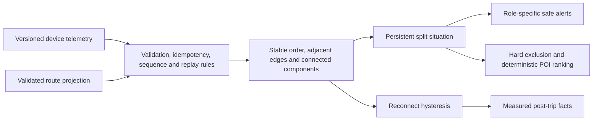

# Runnable convoy core demo

## Purpose

This slice turns the convoy design into executable, deterministic domain behavior. It proves the hackathon’s central journey without pretending that fixture route projections are production GPS or collision-avoidance data.



AWS, mobile, web, and map providers are adapters around these pure functions. They do not reimplement or override the safety rules.

## Implemented behavior

- Strict `LocationTelemetryV1` and separate `ProjectedLocationV1` schemas.
- Duplicate event and stale-sequence rejection.
- Offline replay accepted for history only, never as live incident evidence.
- Confidence classification from observation age, device accuracy, and map-match confidence.
- Route-progress ordering with a 12-second stable-overtake window.
- Adjacent-only route gaps with root-sum-square GPS uncertainty.
- Speed-band cohesion thresholds, 15-second stretch persistence, 30-second break persistence, and 30-second reconnect hysteresis.
- Continuous confident evidence: a low-confidence interval resets pending break timers.
- Connected components split only at broken adjacent boundaries.
- One stable split situation ID with structured evidence and peak-gap preservation.
- One deduplicated, expiring alert per member, selected for leader/front/rear/boundary roles in Vietnamese or English.
- Hard POI exclusion before normalized weighted scoring.
- Deterministic reconnection messages and measured trip summary.

## Package ownership

| Module | Owns |
|---|---|
| `packages/convoy-core/src/contracts.ts` | Versioned boundary and domain types |
| `ingestion.ts` | Validation, idempotency, sequence, replay, confidence and connectivity |
| `ordering.ts` | Stable route-progress order across GPS jitter and overtakes |
| `graph.ts` | Uncertainty, edge state, graph revision and components |
| `situations.ts` | Stable incident identity, evidence and lifecycle |
| `notifications.ts` | Recipient policy, bilingual templates, dedupe and expiry |
| `regroup.ts` | Candidate exclusions, score breakdown and deterministic ties |
| `summary.ts` | Measured post-trip facts and template narrative |
| `packages/demo-scenarios` | Shared workbook-backed golden frames and deterministic replay controller |
| `apps/simulator` | CLI compatibility adapter and console/JSON output only |
| `apps/web` | Browser session adapter and setup/live/regroup/summary presentation only |

## Run it

From the repository root:

```powershell
npm.cmd install
npm.cmd run test:core
npm.cmd run simulate
npm.cmd run simulate -- --json
```

The human timeline must show this progression:

```text
together → degraded → together → stretched → split → stretched → together
```

The confirmed split has front component `M001, M002, M003`, rear component `M004`, boundary `M003 → M004`, and measured route gap `900 m`. `POI001` Minh Châu Rest Stop is selected; `POI002` Highway Shoulder KM62 is excluded as unsafe and unsuitable for convoy parking.

The CLI and browser import the same `@loopin/demo-scenarios` frames. Neither client carries its own copy of the convoy decisions. The browser controller adds play/pause, step, restart, speed and approval gates without recalculating authoritative outcomes.

## Workbook provenance

The fixture uses the supplied synthetic workbook `ai_maps_track7_dataset_participants.xlsx`:

- `Group Trips`: TRIP001 and R001 identity.
- `Trip Members`: M001–M004 names, roles, and vehicle context.
- `Route Waypoints`: the Hà Nội–Hạ Long route and safe-stop context.
- `Regroup POIs`: POI001, POI002, POI003 attributes.
- `GPS Traces` and `Trip Events`: scenario intent and expected detections.

The workbook samples are spaced too widely and include a convenience `distance_from_leader_km` field that is not authoritative convoy geometry. The golden fixture therefore creates explicit 5-second route-progress projections while preserving workbook identities and scenario facts. Production replaces only that fixture projection with the Tasco map-matching adapter.

## AWS integration seam

The initial telemetry Lambda will validate MQTT payloads, call the maps adapter, construct `ProjectedLocationV1`, load current trip state from DynamoDB, and invoke the same reducers. It conditionally stores the next revision and publishes derived graph/situation/notification events. Raw GPS continues independently to Firehose/S3.

AppSync receives rate-controlled graph and situation deltas, not every raw GPS point. The React web app and Flutter driver app fetch a snapshot before applying revisions. A revision gap triggers a new snapshot.

The pure package has no AWS SDK, React, database, clock, network, or LLM dependency, so the telemetry processor can later move from Lambda to ECS or Managed Flink without changing client or event contracts.

## Explicit limitations

- Fixture projections are not live Tasco map matching.
- No production authentication, authorization, persistence, MQTT, AppSync, push, or background mobile capture exists in this slice.
- Phone GPS is not precise following-distance or collision-avoidance equipment.
- Cohesion thresholds are proposed defaults requiring simulation, Tasco review, and field calibration.
- The deterministic web slice includes ordinary regroup review and approval; real navigation delivery and driver acknowledgements remain mobile/AWS work.
- AI does not detect, authorize, or score safety decisions; future Bedrock usage is explanation-only with deterministic fallback.
