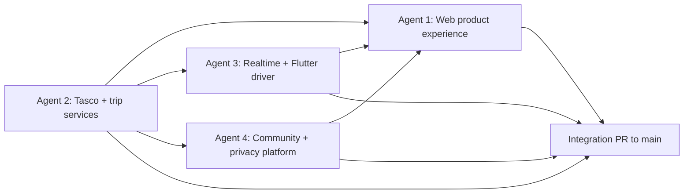

# Loopin Four-Agent Delivery Implementation Plan

> **For agentic workers:** REQUIRED SUB-SKILL: Use superpowers:subagent-driven-development (recommended) or superpowers:executing-plans to implement this plan task-by-task. Steps use checkbox (`- [ ]`) syntax for tracking.

**Goal:** Split the remaining Loopin platform work into four independently shippable agent workstreams that can run from the combined platform branch and integrate cleanly into `main`.

**Architecture:** The work is split by product ownership boundary rather than by file type. Agent 1 owns the React user experience, Agent 2 owns Tasco Maps and trip-planning service contracts, Agent 3 owns real-time convoy execution and Flutter driver capture, and Agent 4 owns community, privacy, profile and partner-platform surfaces. Shared contracts flow through `packages/contracts`, `packages/tasco-maps`, `packages/trip-planning`, `packages/convoy-core` and documented HTTP/event contracts.

**Tech Stack:** React 19, Vite, TypeScript, React Router, TanStack Query, Zustand, Tailwind CSS, shadcn/ui, MapLibre, Flutter, Dart, Riverpod, go_router, Drift/SQLite, AWS Lambda, API Gateway, IoT Core, Kinesis, DynamoDB, AppSync Events, PostgreSQL/PostGIS, S3, CloudFront, GitHub Actions.

## Global Constraints

- Base branch: use `codex/combined-platform` until it lands in `main`; after it lands, branch from `main`.
- PR target: `main`. Do not target `dev`.
- Branch names: use the branch name assigned in each agent section.
- Commit discipline: commit every reviewable unit of work with an imperative message.
- Deployment: do not deploy into AWS from these feature branches. Keep infra deployable and documented for the infra owner.
- Tasco source of truth: maps, places, routes, POIs and recommendations that are displayed as map data must come through the Tasco facade or Tasco-backed contracts.
- Safety authority: deterministic domain code owns convoy state, separation detection, regroup filtering and driver-facing safety instructions.
- AI role: AI may explain, summarize or rank already-valid options; it must not invent routes, regroup POIs or safety decisions.
- Driver safety copy: never instruct a driver to speed up, brake suddenly or stop at an unverified location.
- Location confidence: every live location surface must show freshness and confidence or degrade honestly.
- Frontend work: use `frontend-skill`, follow `docs/frontend-standards.md`, and verify desktop, mobile, keyboard, accessibility and reduced-motion behavior.
- Mobile work: Flutter owns continuous device capture and driver-safe UX; web must not claim reliable background GPS.
- Contracts: update shared contracts before wiring clients; generated Dart contract artifacts must be refreshed when TypeScript contract schemas change.
- Tests: each branch must run the narrow tests listed in its section plus `npm.cmd run typecheck --workspaces --if-present` when TypeScript contracts change.

---

## Current Product Gap

The combined branch currently proves a strong demo slice, but it is not yet the full platform from the old Loopin ZIP and new Tasco/community direction.

Implemented web routes:

- `/`
- `/trip/new`
- `/trips/TRIP001/live`
- `/trips/TRIP001/summary`
- not-found handling

Major missing product areas:

- Authentication, onboarding, settings and profile.
- Real trip list, trip creation, itinerary editing, sharing and collaboration.
- Tasco-backed Explore, place detail, route planning and place recommendations.
- Real live map with current users, place overlays, route progress and fresh remote state.
- Flutter driver tracking, offline queue, background GPS, voice/TTS, haptics and acknowledgement flows.
- Production event flow from telemetry to DynamoDB/AppSync to web/mobile clients.
- Community reviews, ratings, travel presence, privacy controls, reports and moderation.
- Partner and judge-facing business-model surfaces.

## Dependency Graph



Agent 2 should publish shared contracts first because Agents 1, 3 and 4 need stable place, route, trip and membership shapes. Agents 1, 3 and 4 may start with fixtures as long as they replace fixture boundaries with the shared contracts before PR review.

## Shared Contracts To Align Early

These are the contracts every agent should treat as shared, not local.

| Contract | Owner | Consumers | Required shape |
|---|---|---|---|
| `TascoPlaceRef` | Agent 2 | Agents 1 and 4 | `{ id, provider: "tasco", name, address, coordinates, categories, ratingSummary?, sourceVersion }` |
| `TripPlanSummary` | Agent 2 | Agents 1 and 3 | Trip id, title, lifecycle state, origin, destination, stops, route summary, departure time, policy id, member count |
| `TripStop` | Agent 2 | Agents 1 and 4 | Stop id, `TascoPlaceRef`, planned window, notes, locked state, source |
| `JoinTripResult` | Agent 2 | Agent 3 | Trip id, member id, role, consent requirements, route offline summary |
| `LiveMemberSnapshot` | Agent 3 | Agent 1 | Member id, display name, vehicle label, role, route progress, speed, accuracy, freshness, confidence, component id |
| `ConvoySituationEvent` | Agent 3 | Agents 1 and 4 | Situation id, type, lifecycle state, severity, evidence, policy version, affected members, recommended actions |
| `LocationVisibilityPolicy` | Agent 4 | Agents 1 and 3 | User id, trip visibility, place-presence visibility, retention preference, blocked users, updated timestamp |
| `PlaceCommunitySummary` | Agent 4 | Agents 1 and 2 | Place id, star average, review count, comment count, viewer permission flags |

## Agent 1: Web Product Experience

**Branch:** `codex/agent-1-web-product-experience`

**Mission:** Build the user-facing React platform experience around the existing visual language: auth-ready app shell, dashboard, trip planning, Tasco Explore, itinerary editing, live trip viewing, settings entry points and clean integration hooks for real services.

**Owns:**

- React routes, layouts, navigation and page-level state in `apps/web/src`.
- Visual consistency with the current landing/demo style.
- Web data hooks and typed client adapters for trip, maps, live and community APIs.
- Web tests, accessibility checks and Playwright flows.

**Does not own:**

- Tasco client internals or mock server behavior.
- Convoy graph safety logic.
- Flutter location capture.
- Community authorization rules.
- AWS deployment.

**Read before work:**

- `docs/frontend-standards.md`
- `docs/product-spec.md`
- `docs/data-and-api-contracts.md`
- `docs/superpowers/specs/2026-07-11-loopin-web-trip-experience-design.md`
- `docs/superpowers/specs/2026-07-11-loopin-landing-page-design.md`
- Old ZIP reference under `reference-materials/old-loopin/`

**Pages and features to deliver:**

- `/login`, `/signup`, `/forgot-password`, `/reset-password` with Cognito-ready form boundaries and local fixture mode.
- `/onboarding` with travel style, interests, destination preferences, budget, companion and dietary preferences.
- `/app` dashboard with upcoming trips, AI planner prompt entry, quick destination cards and readiness reminders.
- `/app/trips` trip list with draft, ready, active, completed and archived states.
- `/app/trips/new` real trip wizard using Tasco search and trip-planning contracts.
- `/app/trips/:tripId` trip overview with route, members, planned stops, join code, readiness and lifecycle actions.
- `/app/trips/:tripId/itinerary` itinerary editor with day/stops view, add/remove/reorder/swap stop actions and route estimates.
- `/app/trips/:tripId/share` collaboration, invite link, QR, roles, export and print surfaces.
- `/app/trips/:tripId/live` upgraded from TRIP001-only demo into contract-driven live mode with fixture fallback.
- `/app/trips/:tripId/summary` upgraded from demo-only summary into summary-by-trip contract mode.
- `/app/explore` Tasco-backed search, categories, nearby places, hidden gems and map/list modes.
- `/app/places/:placeId` place detail with Tasco facts, route actions, ratings summary and comments slot.
- `/app/now` day-of-trip command center with current plan, near-me recommendations and safe quick actions.
- `/app/settings` profile, privacy, notifications, language, accessibility and data retention entry points.

**Implementation tasks:**

- [ ] Create route inventory and app shell.
  - Files: `apps/web/src/app/App.tsx`, `apps/web/src/app/routes.tsx`, `apps/web/src/shared/*`.
  - Deliverable: nested authenticated shell with sidebar/topbar and public auth routes.
  - Test: `npm.cmd test --workspace @loopin/web -- --run App`.
  - Commit: `feat(web): add app shell routes`.
- [ ] Add typed API adapters with fixture fallback.
  - Files: `apps/web/src/api/*`, `apps/web/src/app/queryClient.ts`.
  - Consumes: Agent 2 `TripPlanSummary`, `TascoPlaceRef`; Agent 3 `LiveMemberSnapshot`; Agent 4 `PlaceCommunitySummary`.
  - Produces: React Query hooks named `useTrips`, `useTrip`, `usePlaceSearch`, `useLiveTrip`, `usePlaceCommunitySummary`.
  - Test: adapter unit tests with mocked `fetch`.
  - Commit: `feat(web): add typed api hooks`.
- [ ] Build auth and onboarding pages.
  - Files: `apps/web/src/auth/*`, `apps/web/src/onboarding/*`.
  - Requirement: no real credentials in logs; local fixture mode must be visually obvious to developers only.
  - Test: component tests for validation and navigation.
  - Commit: `feat(web): add auth onboarding flow`.
- [ ] Build dashboard and trip list.
  - Files: `apps/web/src/dashboard/*`, `apps/web/src/trips/*`.
  - Requirement: empty, loading, error and stale-data states are visible.
  - Test: dashboard and trip-list tests.
  - Commit: `feat(web): add dashboard trip list`.
- [ ] Build trip creation and itinerary editor.
  - Files: `apps/web/src/trip-planner/*`, `apps/web/src/itinerary/*`.
  - Requirement: every displayed map/place result is sourced through the Tasco facade contract.
  - Test: wizard flow, stop reorder, stop replacement and failed route refresh.
  - Commit: `feat(web): add trip planner itinerary editor`.
- [ ] Build Explore and place detail pages.
  - Files: `apps/web/src/explore/*`, `apps/web/src/places/*`.
  - Requirement: separate Tasco facts from community ratings; do not merge untrusted review text into Tasco metadata.
  - Test: search, category filter, place detail loading and no-results states.
  - Commit: `feat(web): add tasco explore place pages`.
- [ ] Upgrade live and summary pages to dynamic trips.
  - Files: `apps/web/src/live-trip/*`, `apps/web/src/trip-summary/*`.
  - Requirement: current TRIP001 demo still works; live mode uses freshness/confidence labels.
  - Test: existing Playwright demo plus one fixture dynamic trip route.
  - Commit: `feat(web): support dynamic live trips`.
- [ ] Build settings entry points.
  - Files: `apps/web/src/settings/*`, `apps/web/src/profile/*`.
  - Requirement: privacy and notification settings consume Agent 4 contract names even before backend persistence is wired.
  - Test: settings form validation and persistence mock.
  - Commit: `feat(web): add profile settings pages`.
- [ ] Run web verification.
  - Commands: `npm.cmd run lint --workspace @loopin/web`, `npm.cmd run typecheck --workspace @loopin/web`, `npm.cmd test --workspace @loopin/web -- --run`, `npm.cmd run build --workspace @loopin/web`, `npm.cmd run test:e2e --workspace @loopin/web`.
  - Commit if fixes are needed: `test(web): stabilize product experience`.

**Review checklist:**

- No route is hardcoded to `TRIP001` unless it is explicitly the demo entry.
- Pages have loading, empty, error, stale and permission-denied states.
- Mobile width down to 320 CSS pixels has no horizontal overflow.
- Reduced motion still communicates state changes.
- Driver-facing safety copy follows `docs/safety-security-privacy.md`.

## Agent 2: Tasco Maps And Trip Planning Services

**Branch:** `codex/agent-2-tasco-trip-services`

**Mission:** Make Tasco-backed places, routes and trip planning reliable enough for the web, mobile, community and live-trip branches to consume through stable contracts.

**Owns:**

- `packages/tasco-maps`
- `services/maps-facade`
- `packages/trip-planning`
- `services/trips`
- Shared place/trip contracts in `packages/contracts` and `backend/src/contracts`
- Trip and Tasco API documentation updates

**Does not own:**

- React page layout.
- Flutter UX.
- Convoy incident detection internals beyond contracts needed to start/end trips.
- Community review policy.

**Read before work:**

- `docs/tasco_maps_hackathon_api_documentation.pdf`
- `docs/data-and-api-contracts.md`
- `docs/system-architecture.md`
- `packages/tasco-maps/README.md`
- `packages/trip-planning/README.md`
- `services/maps-facade/README.md`

**Known issues to resolve:**

- The route facade adds `requestId` and then strict-parses with `RouteRequestSchema`, which rejects its own enriched body.
- Mock routes do not yet honor requested origin, destination and waypoint geometry.
- Trip examples must satisfy their own schemas.
- Trip service and Tasco service currently duplicate place shapes instead of sharing one stable place contract.
- Trip routes must not accept caller-fabricated Tasco ratings, source or candidates as trusted data.
- Idempotency reservations need bounded lifetime and cleanup.
- Join codes must be high-entropy and non-enumerable.
- Category matching should be exact or taxonomy-based, not accidental substring matching.

**APIs and contracts to deliver:**

- `GET /v1/places/search`
- `GET /v1/places/autocomplete`
- `GET /v1/places/:placeId`
- `GET /v1/places/:placeId/nearby`
- `POST /v1/routes/preview`
- `GET /v1/trips`
- `POST /v1/trips`
- `GET /v1/trips/:tripId`
- `PATCH /v1/trips/:tripId`
- `POST /v1/trips/:tripId/stops`
- `PATCH /v1/trips/:tripId/stops/:stopId`
- `DELETE /v1/trips/:tripId/stops/:stopId`
- `POST /v1/trips/:tripId/routes/refresh`
- `POST /v1/trips/:tripId/invites`
- `POST /v1/trips/join`

**Implementation tasks:**

- [ ] Normalize shared Tasco place contracts.
  - Files: `packages/contracts/src/*`, `packages/tasco-maps/src/schemas.ts`, `packages/trip-planning/src/contracts.ts`.
  - Produces: `TascoPlaceRef`, `TascoRoutePreview`, `TripStop`, `TripPlanSummary`.
  - Test: contract generation and TypeScript schema tests.
  - Commit: `feat(contracts): add shared tasco trip contracts`.
- [ ] Fix Tasco facade request validation and route mock behavior.
  - Files: `packages/tasco-maps/src/*`, `services/maps-facade/src/*`, `services/maps-facade/test/*`.
  - Requirement: server-generated request metadata must not break user payload validation.
  - Test: `npm.cmd run test:maps`.
  - Commit: `fix(maps): validate enriched route requests`.
- [ ] Harden search, category and POI semantics.
  - Files: `services/maps-facade/src/mock-data.ts`, `services/maps-facade/src/mock-server.ts`, `packages/tasco-maps/test/*`.
  - Requirement: no substring category false positives; no unbounded request body.
  - Test: exact category, unknown category, malformed body and rate-limit-shaped error tests.
  - Commit: `fix(maps): harden place search semantics`.
- [ ] Repair trip-planning examples and source trust.
  - Files: `packages/trip-planning/examples/*`, `packages/trip-planning/src/*`, `packages/trip-planning/test/*`.
  - Requirement: clients may request preferences, but Tasco-derived facts must come from trusted facade reads.
  - Test: schema example validation, candidate-source rejection, route refresh.
  - Commit: `fix(trips): trust tasco sourced place facts`.
- [ ] Implement trip service HTTP handlers.
  - Files: `services/trips/src/*`, `services/trips/test/*`.
  - Requirement: create, update, join and refresh operations validate caller role and idempotency key.
  - Test: lifecycle, permission, idempotency and invalid join-code tests.
  - Commit: `feat(trips): add trip planning handlers`.
- [ ] Update data/API documentation.
  - Files: `docs/data-and-api-contracts.md`, `docs/system-architecture.md`.
  - Requirement: docs must distinguish implemented handler, planned AWS adapter and fixture behavior.
  - Commit: `docs(trips): document tasco trip contracts`.
- [ ] Run service verification.
  - Commands: `npm.cmd run contracts:check`, `npm.cmd run test:maps`, `npm.cmd test --workspace @loopin/trip-planning -- --run`, `npm.cmd test --workspace @loopin/trips -- --run`, `npm.cmd run typecheck --workspaces --if-present`.
  - Commit if fixes are needed: `test(trips): stabilize service contracts`.

**Review checklist:**

- All place ids use one contract and provider namespace.
- Mock Tasco behavior remains deterministic but reflects requested route coordinates.
- HTTP handlers never trust caller-supplied ratings, scores or source labels.
- Join and invite flows are not enumerable.
- Docs explain what is mocked, what is Tasco-backed and what requires Tasco credential validation.

## Agent 3: Real-Time Convoy And Flutter Driver

**Branch:** `codex/agent-3-realtime-flutter-driver`

**Mission:** Convert the demo convoy logic into production-shaped real-time flow: Flutter publishes location, backend stores fresh state, convoy-core detects situations, AppSync/IoT notify clients, and the driver app handles alerts safely.

**Owns:**

- `apps/mobile`
- `packages/convoy-core`
- `packages/contracts` telemetry and live-event contracts
- `backend/src/handlers/telemetry-processor.ts`
- `backend/src/domain/*` related to telemetry/live state
- DynamoDB/AppSync/IoT integration adapters
- Relevant infra module changes for live telemetry and notifications

**Does not own:**

- Trip planning UX.
- Tasco search UX.
- Community review surfaces.
- AWS account deployment.

**Read before work:**

- `docs/convoy-intelligence.md`
- `docs/realtime-telemetry.md`
- `docs/safety-security-privacy.md`
- `docs/adr/0001-use-flutter-for-driver-client.md`
- `docs/superpowers/plans/2026-07-11-loopin-flutter-driver-client.md`
- `docs/core-demo-slice.md`

**Current production gap:**

- Backend telemetry processor map-matches/publishes but does not yet persist the full current rider/vehicle state expected by the docs.
- Deployed backend does not yet run `packages/convoy-core` as the authoritative separation detector.
- Flutter app is still foundation-level and not a complete driver experience.

**Events and contracts to deliver:**

- MQTT telemetry input topic: `trips/{tripId}/members/{memberId}/telemetry`
- Current-state snapshot: `LiveMemberSnapshot[]`
- Live event types: `liveSnapshotUpdated`, `convoySituationCreated`, `convoySituationUpdated`, `regroupCandidateSelected`, `driverAlertIssued`, `driverAlertAcknowledged`
- Lifecycle APIs: `POST /v1/trips/:tripId/start`, `POST /v1/trips/:tripId/pause`, `POST /v1/trips/:tripId/resume`, `POST /v1/trips/:tripId/complete`

**Implementation tasks:**

- [ ] Align telemetry and live-event contracts.
  - Files: `packages/contracts/src/*`, `backend/src/contracts/telemetry.ts`, `apps/mobile/lib/*`.
  - Produces: TypeScript and generated Dart models for telemetry, live snapshot and situation event payloads.
  - Test: `npm.cmd run contracts:check`, `npm.cmd run mobile:test`.
  - Commit: `feat(contracts): add live convoy event contracts`.
- [ ] Persist current live state in telemetry processing.
  - Files: `backend/src/handlers/telemetry-processor.ts`, `backend/src/lib/dynamo/*`, `backend/test/*`.
  - Requirement: reject stale, duplicate and low-confidence records according to policy; preserve last accepted state with TTL.
  - Test: duplicate, late, stale, low-confidence and valid event cases.
  - Commit: `feat(telemetry): persist live member state`.
- [ ] Invoke convoy-core from backend adapters.
  - Files: `backend/src/domain/*`, `packages/convoy-core/src/*`, `backend/test/domain.test.ts`.
  - Requirement: graph ordering, component split, ahead-of-leader and regroup candidate evidence must come from deterministic domain code.
  - Test: golden R001 split, overtaking stability and reconnection cases.
  - Commit: `feat(convoy): detect live component splits`.
- [ ] Publish AppSync and alert events.
  - Files: `backend/src/lib/appsync/publisher.ts`, `backend/src/lib/sns/push.ts`, `backend/src/contracts/notification.ts`, `infra/modules/realtime/*`.
  - Requirement: stale events expire; obsolete instructions are revoked or superseded.
  - Test: event payload schema and publisher failure fallback.
  - Commit: `feat(realtime): publish convoy live events`.
- [ ] Build Flutter join/readiness/tracking flow.
  - Files: `apps/mobile/lib/features/*`, `apps/mobile/test/*`.
  - Requirement: foreground/background permission states, connectivity state, battery warning and route offline summary are visible.
  - Test: widget tests for readiness, denied permissions and offline queue.
  - Commit: `feat(mobile): add driver readiness flow`.
- [ ] Build Flutter driver-safe live mode.
  - Files: `apps/mobile/lib/features/drive/*`, `apps/mobile/lib/platform/*`.
  - Requirement: low-distraction alerts, TTS/haptic adapters, acknowledgement, rest request, leave formation, report issue and emergency affordances.
  - Test: alert rendering, acknowledgement, offline replay and permission denial tests.
  - Commit: `feat(mobile): add driver live mode`.
- [ ] Update telemetry and operations docs.
  - Files: `docs/realtime-telemetry.md`, `docs/testing-and-operations.md`, `docs/aws-deployment.md`.
  - Requirement: docs match whether state is DynamoDB, AppSync, IoT, S3 or local fixture.
  - Commit: `docs(realtime): document live convoy flow`.
- [ ] Run real-time verification.
  - Commands: `npm.cmd run test:core`, `npm.cmd test --workspace @loopin/backend -- --run`, `npm.cmd run contracts:check`, `npm.cmd run mobile:format-check`, `npm.cmd run mobile:analyze`, `npm.cmd run mobile:test`, `npm.cmd run typecheck --workspaces --if-present`.
  - Commit if fixes are needed: `test(realtime): stabilize live driver flow`.

**Review checklist:**

- Phone GPS is not described as collision avoidance.
- All driver alerts are safe, short and role-specific.
- Stale or low-confidence telemetry cannot independently create high-confidence incidents.
- Duplicate and replayed telemetry do not duplicate situations or notifications.
- Flutter models are generated or shared through the contract pipeline, not hand-copied.

## Agent 4: Community, Privacy, Profile And Partner Platform

**Branch:** `codex/agent-4-community-settings-platform`

**Mission:** Build the social and platform layer around trips and places: place ratings/comments, opt-in travel presence, profile/settings, privacy enforcement, reports/moderation and partner/judge-facing business surfaces.

**Owns:**

- `services/community`
- Community contracts in `packages/contracts` and `backend/src/contracts`
- Privacy and profile settings contracts
- Web community/profile/settings pages where Agent 1 has not already built generic shells
- Partner/admin documentation and MVP pages

**Does not own:**

- Tasco place fact generation.
- Trip route planning logic.
- Convoy safety decisions.
- Flutter background GPS.
- AWS deployment.

**Read before work:**

- `docs/product-spec.md`
- `docs/safety-security-privacy.md`
- `docs/data-and-api-contracts.md`
- `services/community/src/*`
- Old ZIP Social/Profile/Settings/Share patterns under `reference-materials/old-loopin/`

**Known issues to resolve:**

- Reverse blocking checks use the wrong id in at least one path.
- Privacy denylist can be bypassed unless all read paths enforce it centrally.
- User labels can leak where only redacted display names should be returned.
- JSON-stringify key checks can create false positives.
- Review/report writes need stronger idempotency and transactional behavior.
- `isModerator` must come from a trusted identity boundary, not untrusted caller body.

**Pages and features to deliver:**

- `/app/community` place/trip social overview with privacy-safe presence.
- `/app/places/:placeId/reviews` ratings, comments, report and sort/filter views.
- `/app/profile` user profile with travel style, interests and visible contribution history.
- `/app/settings/privacy` location visibility, place presence, blocked users, retention and data export/delete controls.
- `/app/settings/notifications` trip, community, voice and push preferences.
- `/app/admin/moderation` report queue and moderator actions for trusted moderator users.
- `/app/partners` lightweight judge/partner business-model page explaining consumer trips, tourism groups, fleet pilots and anonymized analytics boundaries.

**APIs and contracts to deliver:**

- `GET /v1/places/:placeId/community-summary`
- `GET /v1/places/:placeId/reviews`
- `POST /v1/places/:placeId/reviews`
- `PATCH /v1/reviews/:reviewId`
- `DELETE /v1/reviews/:reviewId`
- `POST /v1/reports`
- `GET /v1/moderation/reports`
- `POST /v1/moderation/reports/:reportId/actions`
- `GET /v1/users/me/profile`
- `PATCH /v1/users/me/profile`
- `GET /v1/users/me/privacy`
- `PATCH /v1/users/me/privacy`
- `GET /v1/presence/places/:placeId`
- `PATCH /v1/users/me/presence-settings`

**Implementation tasks:**

- [ ] Centralize privacy authorization.
  - Files: `services/community/src/privacy.ts`, `services/community/src/repositories.ts`, `services/community/test/privacy.test.ts`.
  - Produces: one read-path guard that applies visibility, blocklists and place-presence consent.
  - Test: viewer blocked by author, author blocked by viewer, anonymous viewer, trip-only visibility and public visibility.
  - Commit: `fix(community): centralize privacy checks`.
- [ ] Fix community identity and moderation trust.
  - Files: `services/community/src/contracts.ts`, `services/community/src/index.ts`, `services/community/test/authorization.test.ts`.
  - Requirement: moderator rights come from trusted auth context; response labels are redacted when privacy requires it.
  - Test: untrusted `isModerator` body fails; trusted moderator succeeds; redacted labels do not leak.
  - Commit: `fix(community): trust moderator auth context`.
- [ ] Add durable review/report idempotency.
  - Files: `services/community/src/memory-repositories.ts`, `services/community/src/repositories.ts`, `services/community/test/community.test.ts`.
  - Requirement: repeated writes with the same idempotency key return the same result and do not double-count aggregates.
  - Test: duplicate review, duplicate report, aggregate update and deletion.
  - Commit: `feat(community): add idempotent review writes`.
- [ ] Publish community/profile contracts.
  - Files: `packages/contracts/src/*`, `backend/src/contracts/*`, `services/community/src/contracts.ts`.
  - Produces: `PlaceCommunitySummary`, `Review`, `ReviewReport`, `LocationVisibilityPolicy`, `UserTravelProfile`.
  - Test: contract generation and service contract tests.
  - Commit: `feat(contracts): add community privacy contracts`.
- [ ] Implement community/profile HTTP handlers.
  - Files: `services/community/src/index.ts`, `services/community/test/*`.
  - Requirement: every read applies privacy guard and every write records actor id from trusted context.
  - Test: service tests for all APIs listed above.
  - Commit: `feat(community): add profile privacy handlers`.
- [ ] Add web pages or integrate with Agent 1 shell.
  - Files: `apps/web/src/community/*`, `apps/web/src/settings/*`, `apps/web/src/profile/*`, `apps/web/src/partners/*`.
  - Requirement: when Agent 1 owns the shell, keep pages as route modules and coordinate route registration through a small merge.
  - Test: privacy settings, place reviews, report flow and moderation empty/error states.
  - Commit: `feat(web): add community privacy pages`.
- [ ] Document privacy and partner model.
  - Files: `docs/safety-security-privacy.md`, `docs/product-spec.md`, `docs/roadmap.md`.
  - Requirement: public location visibility is opt-in, trip-scoped live location is not exposed publicly, analytics are aggregated or anonymized.
  - Commit: `docs(platform): document community partner model`.
- [ ] Run community verification.
  - Commands: `npm.cmd test --workspace @loopin/community -- --run`, `npm.cmd run contracts:check`, `npm.cmd run typecheck --workspaces --if-present`, `npm.cmd test --workspace @loopin/web -- --run community settings profile`.
  - Commit if fixes are needed: `test(community): stabilize privacy platform`.

**Review checklist:**

- No precise live trip location is publicly exposed.
- Place presence is opt-in and revocable.
- Reviews/comments are separated from Tasco facts.
- Reports and moderation cannot be driven by untrusted role flags.
- Partner/business pages do not fabricate customers, pricing, metrics or partnerships.

## Integration Rules For All Agents

- [ ] Start from `codex/combined-platform` if PR 9 is still open; otherwise start from latest `main`.
- [ ] Keep branch scope to the assigned workstream.
- [ ] Add or update tests in the same commit as the behavior they cover.
- [ ] Update owning docs in the same branch when behavior changes.
- [ ] Run narrow tests before each commit that changes behavior.
- [ ] Push the branch after each meaningful commit so other agents can rebase.
- [ ] Open PR to `main` only.
- [ ] In the PR description, list touched contracts, new routes, new endpoints, verification commands and unresolved external validations.
- [ ] Before requesting review, rebase or merge latest integration base and rerun affected tests.

## Cross-Agent Merge Plan

Recommended merge order:

1. Agent 2 first, because place/trip contracts unblock all clients.
2. Agent 3 second, because live contracts and driver state unblock dynamic web live pages.
3. Agent 4 third, because community/privacy contracts can attach to stable place and profile surfaces.
4. Agent 1 last or in parallel with fixture contracts, because it touches the broadest web surface and will need final route integration.

Conflict hotspots:

- `packages/contracts/src/*`
- `backend/src/contracts/*`
- `apps/web/src/app/App.tsx`
- `apps/web/src/styles.css`
- `docs/data-and-api-contracts.md`
- `docs/product-spec.md`
- `docs/safety-security-privacy.md`

Conflict strategy:

- Contracts win over local duplicate shapes.
- Safety docs win over marketing or UX copy when they disagree.
- Tasco facts and community reviews remain separate.
- Web route conflicts should be resolved through route-module registration, not by folding all pages into `App.tsx`.

## Final Review Gate

Run this after all four branches are integrated:

```powershell
npm.cmd install
npm.cmd run contracts:check
npm.cmd run lint
npm.cmd run typecheck
npm.cmd test -- --run
npm.cmd run test:maps
npm.cmd run test:core
npm.cmd run build
npm.cmd run mobile:format-check
npm.cmd run mobile:analyze
npm.cmd run mobile:test
npm.cmd run test:e2e
```

For AWS-readiness only, the infra owner should additionally run Terraform validation and the development deployment workflow from their authenticated AWS environment. Feature agents should not deploy to AWS unless explicitly assigned that responsibility.

## Acceptance Definition

This four-agent split is complete when:

- A real user can sign in or use fixture auth, onboard, create a Tasco-backed trip, edit itinerary stops, invite members and open a live trip.
- A Flutter driver can join the trip, pass readiness, publish fresh location telemetry, receive safe role-specific alerts, acknowledge them and tolerate offline periods.
- The backend persists current live state, derives route-aware convoy components and publishes live events with freshness and confidence.
- A user can discover Tasco-backed places, see ratings/comments separately from Tasco facts, control visibility, report unsafe content and manage profile/settings.
- The public and partner-facing story remains honest: no fabricated proof, no public live-location exposure and no AI-only safety decisions.
